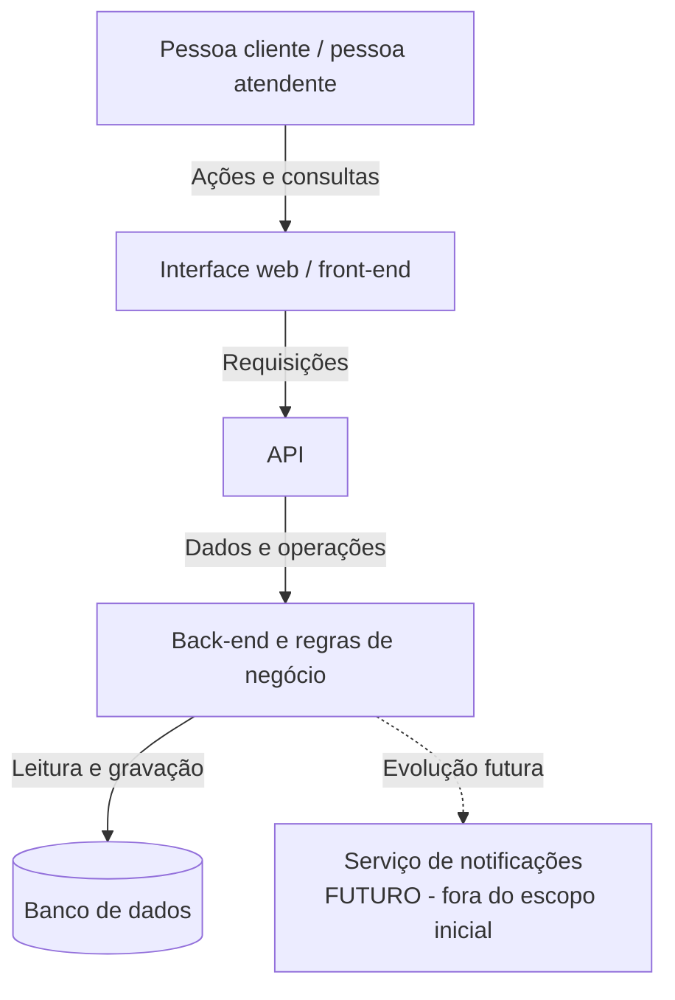

# Diagrama arquitetural simplificado

A arquitetura foi organizada em camadas para separar a apresentação, a comunicação, as regras de negócio e o armazenamento. Essa divisão ajuda a manter o projeto compreensível e prepara uma possível implementação web posterior, sem exigir código nesta atividade.

## Sentido principal da comunicação

Pessoa usuária → interface web → API → back-end e regras de negócio → banco de dados.

As respostas retornam do back-end pela API até a interface web, que apresenta o resultado à pessoa usuária.

O serviço de notificações está marcado como futuro e não pertence ao escopo obrigatório da primeira versão.

## Justificativa da organização

A interface fica responsável pela interação com a pessoa usuária; a API funciona como ponto de comunicação; o back-end concentra as regras; e o banco de dados mantém os registros. Essa separação é compatível com a forma como venho estudando desenvolvimento web e Python, mas as tecnologias concretas serão escolhidas somente na etapa de implementação.
