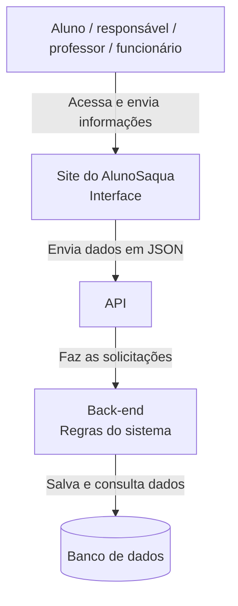

# Arquitetura do AlunoSaqua

O desenho mostra de forma simples como as partes do AlunoSaqua se conectam.

## Como funciona

A pessoa usa o site para registrar uma solicitação ou consultar o andamento. A interface envia os dados para a API, o back-end confere tudo e o banco guarda as informações. Depois, o resultado volta para a tela.

## Função de cada parte

- **Pessoa usuária:** acessa o sistema e envia ou acompanha uma solicitação.
- **Interface:** mostra as telas, formulários e resultados.
- **API:** recebe os pedidos da interface e devolve as respostas.
- **Back-end:** cuida das validações e das regras do AlunoSaqua.
- **Banco de dados:** armazena usuários, solicitações e outras informações da escola.

> **Comentário do grupo:** separamos as partes dessa forma porque fica mais fácil entender o que cada uma faz. Também ajuda caso alguma parte precise mudar depois.
